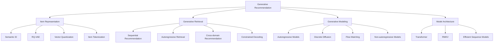
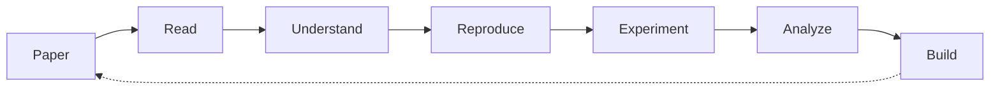

<!-- ========================================================= -->
<!--                    GALAXY // GHOST                        -->
<!-- ========================================================= -->

<div align="center">


<br>


<br><br>

`GENERATE` · `RETRIEVE` · `REPRESENT` · `LEARN`

</div>

---

# `00 // WHOAMI`

```yaml
name: Galaxy
github: Galaxy-ghost

research:
  primary: Generative Recommendation
  focus:
    - Semantic ID
    - Item Tokenization
    - Generative Retrieval
    - Sequential Recommendation
    - Discrete Diffusion
    - Flow Matching
    - Recommendation Foundation Models

exploring:
  - Transformer
  - RWKV
  - Efficient Sequence Models
  - RAG
  - Vector Retrieval

stack:
  - Python
  - PyTorch
  - C++
  - Linux

environment:
  os: CachyOS
  editor: Neovim

contact:
  wechat: Shinax06
```

> **Exploring how generative modeling can reshape recommendation and retrieval systems.**

---

# `01 // RESEARCH`

<div align="center">

### GENERATIVE RECOMMENDATION

```text
┌──────────────────────────────────────────────────────────┐
│                                                          │
│                     USER BEHAVIOR                        │
│                          │                               │
│                          ▼                               │
│               ┌───────────────────┐                      │
│               │  REPRESENTATION   │                      │
│               │                   │                      │
│               │ Embedding / SID   │                      │
│               └─────────┬─────────┘                      │
│                         │                                │
│                         ▼                                │
│       ┌─────────────────────────────────────┐            │
│       │         GENERATIVE BACKBONE         │            │
│       │                                     │            │
│       │ Transformer · RWKV · Diffusion · FM │            │
│       └──────────────────┬──────────────────┘            │
│                          │                               │
│                          ▼                               │
│               ┌───────────────────┐                      │
│               │ GENERATE TOKENS   │                      │
│               └─────────┬─────────┘                      │
│                         │                                │
│                         ▼                                │
│                   RECOMMENDATION                         │
│                                                          │
└──────────────────────────────────────────────────────────┘
```

### `Retrieve → Rank → Recommend`

### ↓

### `Represent → Generate → Recommend`

</div>

---

# `02 // CURRENT FOCUS`

<table>
<tr>

<td width="50%" valign="top">

<h3>◈ Semantic ID</h3>

Transform arbitrary item IDs into structured and learnable discrete representations.

```text
ITEM
 │
 ▼
Embedding
 │
 ▼
Quantization
 │
 ▼
Semantic Tokens

[12] [07] [38] [04]
```

**Exploring**

- Semantic ID
- RQ-VAE
- Vector Quantization
- Residual Quantization
- Item Tokenization
- Discrete Representation

</td>

<td width="50%" valign="top">

<h3>◈ Generative Retrieval</h3>

Reformulate recommendation and retrieval as sequence generation.

```text
USER HISTORY
      │
      ▼
GENERATIVE MODEL
      │
      ▼
 <SID_12>
 <SID_07>
 <SID_38>
      │
      ▼
 TARGET ITEM
```

**Exploring**

- Generative Retrieval
- Autoregressive Generation
- Constrained Decoding
- Sequential Recommendation
- Cross-domain Recommendation

</td>

</tr>

<tr>

<td width="50%" valign="top">

<h3>◈ Diffusion / Flow</h3>

Explore non-autoregressive approaches for generative recommendation.

```text
NOISE / MASK
     │
     ▼
GENERATIVE PROCESS
     │
     ▼
DENOISING
     │
     ▼
ITEM TOKENS
```

**Exploring**

- Discrete Diffusion
- Masked Diffusion
- Flow Matching
- Non-autoregressive Generation

</td>

<td width="50%" valign="top">

<h3>◈ Efficient Architecture</h3>

Explore efficient alternatives to conventional Transformer inference.

```text
TRANSFORMER
    │
    ├── Attention
    └── KV Cache

RWKV
    │
    └── Recurrent Inference
```

**Exploring**

- Transformer
- RWKV
- Efficient Sequence Models
- Alternative Architectures

</td>

</tr>
</table>

---

# `03 // RESEARCH MAP`



---

# `04 // TECH STACK`

<div align="center">

### `LANGUAGES`


<br><br>

### `AI / DEEP LEARNING`


<br><br>

### `ENGINEERING`


<br><br>


</div>

---

# `05 // KNOWLEDGE GRAPH`

```text
                         GENERATIVE AI
                              │
              ┌───────────────┼───────────────┐
              │               │               │
              ▼               ▼               ▼
        Transformer       Diffusion      Flow Matching
              │               │               │
              └───────────────┼───────────────┘
                              │
                              ▼
                  GENERATIVE MODELING
                              │
                              ▼
               GENERATIVE RECOMMENDATION
                              │
        ┌─────────────────────┼─────────────────────┐
        │                     │                     │
        ▼                     ▼                     ▼
   Semantic ID        Generative Retrieval     Sequential Rec
        │                     │                     │
        ├─ RQ-VAE             ├─ AR Generation     ├─ History
        ├─ VQ                 ├─ Constraints       ├─ Modeling
        └─ Tokenization       └─ Decoding          └─ Prediction
                              │
                              ▼
                       RECOMMENDATION
```

---

# `06 // CURRENT LEARNING`

```text
[01] Generative Recommendation
     ├── Semantic ID
     ├── Item Tokenization
     ├── Generative Retrieval
     └── Recommendation Foundation Models

[02] Generative Models
     ├── Autoregressive Generation
     ├── Discrete Diffusion
     ├── Flow Matching
     └── Non-autoregressive Generation

[03] Model Architecture
     ├── Transformer
     ├── Encoder / Decoder
     ├── Attention
     ├── RWKV
     └── Efficient Sequence Models

[04] Retrieval
     ├── Vector Search
     ├── ANN
     ├── Reranking
     └── RAG

[05] Engineering
     ├── Python
     ├── PyTorch
     ├── C++
     ├── Git
     └── Linux
```

---

# `07 // RESEARCH PIPELINE`



<div align="center">

```text
READ
 │
 ▼
UNDERSTAND
 │
 ▼
REPRODUCE
 │
 ▼
EXPERIMENT
 │
 ▼
BREAK SOMETHING
 │
 ▼
UNDERSTAND IT BETTER
 │
 ▼
BUILD
```

</div>

---

# `08 // PROJECTS`

| Project | Research Area | Status |
|---|---|:---:|
| **GenRec Lab** | Generative Recommendation | `BUILDING` |
| **Semantic ID Lab** | Item Representation | `LEARNING` |
| **Generative Retrieval Lab** | Retrieval / Recommendation | `RESEARCH` |
| **Diffusion4Rec** | Discrete Diffusion | `EXPLORING` |
| **Flow4Rec** | Flow Matching | `EXPLORING` |
| **RWKV4Rec** | Efficient Architecture | `EXPLORING` |

---

# `09 // RESEARCH INTERESTS`

<div align="center">


<br>


</div>

---

# `10 // SYSTEM`

```bash
$ whoami
galaxy

$ cat /etc/os-release
CachyOS

$ echo $EDITOR
nvim

$ echo $RESEARCH
Generative Recommendation

$ echo $STATUS
Learning. Reproducing. Experimenting. Building.
```

---

# `11 // CONTACT`

<div align="center">

[](https://github.com/Galaxy-ghost)


</div>

---

<div align="center">

```text
╔════════════════════════════════════════════════════════════╗
║                                                            ║
║        GENERATE  //  RETRIEVE  //  REPRESENT  //  LEARN    ║
║                                                            ║
╚════════════════════════════════════════════════════════════╝
```

## `FROM RANKING TO GENERATION.`

**Exploring the next generation of recommender systems.**

<br>

`GALAXY-GHOST // 2026`

<br>


</div>
<!--
**Galaxy-ghost/Galaxy-ghost** is a ✨ _special_ ✨ repository because its `README.md` (this file) appears on your GitHub profile.

Here are some ideas to get you started:

- 🔭 Hi, I’m @Galaxy-ghost
- 🌱 I’m currently learning c++,Golang
- 📫 How to reach me: [Wechat]Shinax06

-->
